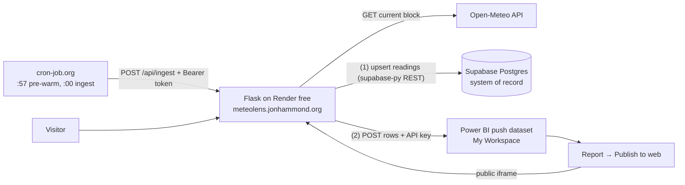

# MeteoLens — Build Plan

Lightweight, $0-to-run weather app: hourly "current conditions" from the **Open-Meteo API** (fields per `API_PLAN.md`) → stored in **Supabase Postgres** → visualized in a **Power BI Service** report (free license, browser-only) embedded in a **Flask** page hosted on **Render** at **meteolens.jonhammond.org**.

Key platform facts this design relies on (verified Aug 2026):

- **Power BI free license** can: create a *streaming dataset (API type) with Historic data analysis ON* in My Workspace (a push dataset fed by plain HTTPS POST with an API key in the URL — no OAuth); build reports on it in the browser; **Publish to web** from My Workspace. It cannot pull from Postgres directly (gateway/paid) — so data is **pushed into** Power BI by our code; Supabase is the system of record.
- **Render free**: 750 instance-hrs/mo (one always-on service fits), spins down after 15 min idle (~30–60 s cold start), custom domains + auto-TLS free, native cron paid.
- **Supabase free**: pauses after ~7 days of low DB activity (hourly inserts keep it alive); Render is IPv4-only and Supabase direct Postgres is IPv6-only → use the supabase-py REST client from Flask (HTTPS), and the IPv4 Supavisor session pooler only for SQL tooling/migrations.
- **Open-Meteo**: free non-commercial, no key; hourly × a few locations is far under fair-use limits.
- Publish-to-web embeds cache data ~1 hour — matches the hourly cadence.

Decisions locked in: configurable `locations` table in Supabase; public Publish-to-web embed accepted; hourly trigger via cron-job.org; Data API settings at project creation: **Enable Data API ON**, **automatic RLS ON**, **automatically expose new tables OFF** (so anon/authenticated hold no table privileges at all; the RLS migration grants `service_role` least privilege explicitly). **Local-first schema workflow**: the Supabase CLI runs the full stack in Docker, migrations are written and verified locally, then `supabase db push` promotes them to the cloud project — nothing is hand-pasted into the cloud SQL Editor.

## Architecture



Dual write per hour, per active location: fetch Open-Meteo → upsert Supabase → push same row (plus location name, WMO description text, and precomputed color/flag helper columns — free Power BI limits DAX, so compute server-side in Python) to the Power BI push URL. Per-location try/except: one failure never aborts the run; Supabase-ok/PBI-fail is recoverable via backfill script.

## Repo layout to create

```
app/
  __init__.py        # create_app(); fail-fast env validation at startup
  config.py          # required: SUPABASE_URL, SUPABASE_SERVICE_ROLE_KEY, POWERBI_PUSH_URL, INGEST_TOKEN; optional: POWERBI_EMBED_URL
  routes.py          # /, /healthz, /api/ingest, /api/latest
  ingest.py          # per-location orchestration: fetch → Supabase upsert → PBI push
  open_meteo.py      # HTTP client for the "current" block
  powerbi.py         # batched POST to push URL (≤1 req/sec, ≤10k rows)
  db.py              # supabase-py client wrapper
  weather_codes.py   # WMO code → description dict (single source of truth; also generates SQL seed)
  templates/index.html
  static/style.css
supabase/
  config.toml        # created by `supabase init`; local stack config
  migrations/        # timestamped files from `supabase migration new` (never hand-named)
    <ts>_create_schema.sql        # tables + index
    <ts>_rls_and_grants.sql       # RLS on, revoke anon/authenticated, least-privilege service_role
    <ts>_seed_reference_data.sql  # idempotent WMO codes + 12 locations (must reach prod → migration, not seed.sql)
scripts/backfill_powerbi.py   # replay Supabase history into a (re)created push dataset
requirements.txt    # flask, gunicorn, supabase, requests
render.yaml         # web service, startCommand: gunicorn wsgi:app, healthCheckPath /healthz, secrets sync:false
wsgi.py
.env.example        # variable NAMES only; .env stays gitignored
```

## Milestones (ordered; each independently verifiable)

### M1 — Supabase schema (local-first, then pushed)
Cloud project already created (**Enable Data API ON**, **automatic RLS ON**, **automatically expose new tables OFF**). Schema is developed against the local Docker stack and promoted:

```
supabase init                     # creates supabase/config.toml
supabase start                    # local stack (first run pulls images, several minutes)
supabase migration new <name>     # ×3 — never hand-author migration filenames
supabase db reset                 # replays all migrations + seeds on a clean local DB
# ... local accept tests (below) ...
supabase login && supabase link --project-ref <ref>   # [USER] interactive browser auth
supabase db push                  # promotes the same migrations to the cloud project
```

Migrations seed `weather_codes` from the WMO dict and `locations` with the 12 Colorado cities below (coordinates verified against Open-Meteo's geocoding API; all `America/Denver`). Seeds live in a migration rather than `supabase/seed.sql` because `db push` promotes only migrations and this reference data is required in prod. All seed inserts are idempotent (`on conflict`) so `db reset` and re-pushes are safe.

```sql
insert into public.locations (name, latitude, longitude) values
  ('Denver',            39.73915, -104.98470),
  ('Colorado Springs',  38.83388, -104.82136),
  ('Pueblo',            38.25445, -104.60914),
  ('Leadville',         39.25082, -106.29252),
  ('Fort Collins',      40.58526, -105.08442),
  ('Durango',           37.27528, -107.88007),
  ('Grand Junction',    39.06387, -108.55065),
  ('Glenwood Springs',  39.55054, -107.32478),
  ('Steamboat Springs', 40.48498, -106.83172),
  ('Castle Rock',       39.37221, -104.85609),
  ('Longmont',          40.16721, -105.10193),
  ('Boulder',           40.01499, -105.27055);
```

```sql
create table public.locations (
  id bigint generated always as identity primary key,
  name text not null unique,
  latitude numeric(8,5) not null,
  longitude numeric(8,5) not null,
  is_active boolean not null default true,
  created_at timestamptz not null default now()
);
create table public.weather_codes (
  code smallint primary key,
  description text not null              -- 0 'Clear sky', 61 'Slight rain', ...
);
create table public.weather_readings (
  id bigint generated always as identity primary key,
  location_id bigint not null references public.locations(id),
  recorded_at timestamptz not null,      -- Open-Meteo current.time normalized to UTC
  temperature_2m numeric(5,2),
  apparent_temperature numeric(5,2),
  relative_humidity_2m smallint,
  precipitation numeric(6,2),
  cloud_cover smallint,
  weather_code smallint references public.weather_codes(code),
  wind_speed_10m numeric(6,2),
  wind_gusts_10m numeric(6,2),
  inserted_at timestamptz not null default now(),
  unique (location_id, recorded_at)      -- upsert target; idempotent ingest
);
create index weather_readings_loc_time_idx
  on public.weather_readings (location_id, recorded_at desc);
alter table public.locations        enable row level security;
alter table public.weather_codes    enable row level security;
alter table public.weather_readings enable row level security;
-- Auto-expose new tables is OFF in the cloud: anon/authenticated hold no table privileges
-- (requests fail with permission denied); RLS with no policies is the second lock. The LOCAL
-- stack still auto-grants to anon/authenticated via default privileges, so revoke explicitly —
-- this is what makes local match prod, and it is a harmless no-op against the cloud:
revoke all on public.locations, public.weather_codes, public.weather_readings
  from anon, authenticated;
-- Flask's secret key maps to service_role (BYPASSRLS); least privilege only, no deletes:
grant usage on schema public to service_role;
grant select on public.locations to service_role;
grant select, insert on public.weather_codes to service_role;          -- Unknown (N) fallback
grant select, insert, update on public.weather_readings to service_role;  -- upsert
-- Identity columns need no sequence grants (unlike serial).
```

Notes: seed the full Open-Meteo WMO code set (~28 codes); on an unseen code, insert it as `Unknown (N)` before the reading (keeps the FK). Request `timeformat=unixtime` from Open-Meteo so `recorded_at` is trivially UTC while `timezone=auto` (per API_PLAN.md) still drives local alignment. `SUPABASE_SERVICE_ROLE_KEY` may hold either the legacy `service_role` JWT or a new `sb_secret_...` secret key (legacy keys sunset end of 2026; both map to the `service_role` DB role).

**Accept (local)**: `supabase db reset` replays cleanly twice; all three tables present with RLS enabled; 28 weather codes + 12 locations; anon-key REST select → `42501` permission denied; service-key REST select → rows.
**Accept (cloud)**: `supabase migration list` shows all three applied remotely; tables visible in the dashboard; publishable-key select fails with permission denied; seeds present.

### M2 — Flask skeleton
Scaffold layout; `create_app()` raises at startup if any required env var is missing (no hardcoded fallbacks — project rule); `/healthz` → 200; `wsgi.py` exposes `app`. Local dev points `SUPABASE_URL` at the local stack (`http://127.0.0.1:54331` — this project's ports are shifted +10 off the 54321 defaults) with keys from `supabase status`; the cloud URL + secret key are used only on Render.
**Accept**: `gunicorn wsgi:app` runs locally with env populated; refuses to start with one unset; `curl /healthz` → 200.

### M3 — Ingestion endpoint (dual write)

| Route | Method | Auth | Purpose |
|---|---|---|---|
| `/` | GET | none | page: latest-conditions cards + PBI iframe |
| `/healthz` | GET | none | liveness + cron pre-warm target |
| `/api/ingest` | POST only | `Authorization: Bearer <INGEST_TOKEN>` (constant-time compare) | run one ingest cycle; per-location JSON summary |
| `/api/latest` | GET | none | newest reading per active location (frontend cards) |

Open-Meteo call: `/v1/forecast?latitude=…&longitude=…&current=temperature_2m,apparent_temperature,relative_humidity_2m,precipitation,cloud_cover,weather_code,wind_speed_10m,wind_gusts_10m&timezone=auto&timeformat=unixtime`. Upsert `on conflict (location_id, recorded_at)`. PBI row adds `location`, `weather_desc`, and helper columns (`precip_color`/`temp_color`/`cloud_color` hex strings, numeric flags/bands) for conditional KPI formatting. All locations batched into one push POST. Returns 200 with `{location: ok|error}` summary.
**Accept**: authed curl → summary JSON; rows in Supabase; re-run adds no dupes; wrong token → 401; GET → 405.

### M4 — Frontend page
`index.html`: title, per-location latest-conditions cards (server-rendered), responsive Power BI `<iframe>` from `POWERBI_EMBED_URL` (placeholder "report pending" until M7); plain CSS3, no JS build.
**Accept**: renders locally with real card data + placeholder iframe.

### M5 — Render deploy + DNS
`render.yaml` (python web service, gunicorn, healthCheckPath `/healthz`, env vars `sync: false`); create service from repo; enter secrets in Render dashboard; add custom domain `meteolens.jonhammond.org`; add the CNAME Render specifies at the jonhammond.org DNS host; wait for auto-TLS.
**Accept**: `https://meteolens.jonhammond.org/healthz` → 200 with valid cert; authed ingest curl against prod writes rows.

### M6 — cron-job.org wiring
Two jobs: pre-warm GET `/healthz` at `57 * * * *`; ingest POST `/api/ingest` at `0 * * * *` with the Bearer header stored in job config; enable failure notifications.
**Accept**: both green in execution history over 2+ hours; one new row/location/hour in Supabase.

### M7 — Power BI dataset, report, embed (browser click-path, My Workspace)
1. **New → Streaming dataset → API**, name `meteolens`. Fields: `recorded_at` DateTime; `location` Text; `temperature_2m`, `apparent_temperature`, `relative_humidity_2m`, `precipitation`, `cloud_cover`, `weather_code`, `wind_speed_10m`, `wind_gusts_10m` Number; `weather_desc`, `precip_color`, `temp_color`, `cloud_color` Text; `precip_flag`, `temp_band`, `cloud_band` Number. **Historic data analysis: ON**. Copy the **Push URL** → set `POWERBI_PUSH_URL` on Render (it embeds an API key — treat as a secret, never in git).
2. Trigger one ingest so rows exist; run `scripts/backfill_powerbi.py` if Supabase already holds history.
3. Dataset → **Create report**: (a) line chart `recorded_at` × `temperature_2m` + `apparent_temperature`; (b) area + secondary-axis combo for `wind_speed_10m` vs `wind_gusts_10m`; (c) scatter `temperature_2m` × `relative_humidity_2m` colored by location; (d) three KPI cards (latest precipitation / temperature / cloud cover) with conditional background → Field value → matching `*_color` column; (e) slicers on `weather_desc` and `location`. Save.
4. **File → Embed report → Publish to web (public)** → copy embed URL → set `POWERBI_EMBED_URL` on Render → redeploy.
**Accept**: report renders logged-out at the public URL and inside meteolens.jonhammond.org; slicers filter all visuals.

### M8 — End-to-end verification checklist
- [ ] Local: POST `/api/ingest` with token → 200 + per-location `ok`; wrong token → 401; GET → 405.
- [ ] Supabase: one new UTC row per active location; re-run adds no dupes; publishable/anon key gets permission denied.
- [ ] Power BI: dataset row count grows after ingest; report shows the new hour.
- [ ] `https://meteolens.jonhammond.org/` resolves with valid TLS; cards match Supabase latest rows.
- [ ] cron-job.org: pre-warm at :57 and ingest at :00 succeed 3 consecutive hours.
- [ ] Public embed loads in incognito; data ≤ ~1 h stale.
- [ ] Kill test: unset one env var locally → app refuses to start.

## Risks & mitigations
- **Render cold start (30–60 s)** → :57 pre-warm ping; ingest kept light so the :00 call finishes inside cron-job.org's 30 s timeout. If location count grows: respond 202 and run in a background thread (idempotent upsert makes retries safe).
- **Publish-to-web ~1 h data cache** → acceptable at hourly cadence; note "updates hourly" on the page.
- **Push dataset ~200k-row FIFO cap** → Supabase is the system of record; `backfill_powerbi.py` can rebuild the dataset anytime (12 locations × 24 rows/day = 288/day ≈ 1.9 years of headroom).
- **Publish to web disabled by tenant setting** → verify the menu item exists early in M7; a tenant admin may need to enable it.
- **Supabase 7-day inactivity pause** → hourly inserts keep it active; if cron lapses, resume in dashboard and re-run ingest.
- **Open-Meteo fair use** → descriptive User-Agent; one retry on 5xx; per-location isolation.
- **Secret hygiene** → all four secrets env-only, validated at startup, `.env` gitignored; user drives all git operations (project rule).

## Free-tier cost check
| Service | Free allowance | MeteoLens usage |
|---|---|---|
| Open-Meteo | ~10k calls/day non-commercial | 288 calls/day (12 locations × 24) |
| Supabase | 500 MB DB, 2 projects | < 10 MB/yr |
| Render | 750 instance-hrs/mo, custom domain + TLS | 1 service ≈ 730 hrs |
| Power BI free | My Workspace, push datasets, Publish to web | 1 dataset, 1 report |
| cron-job.org | free hourly jobs | 2 jobs |

## Out of scope (future ideas)
User auth, historical/forecast Open-Meteo endpoints, alerting on severe weather codes, multiple report pages.
