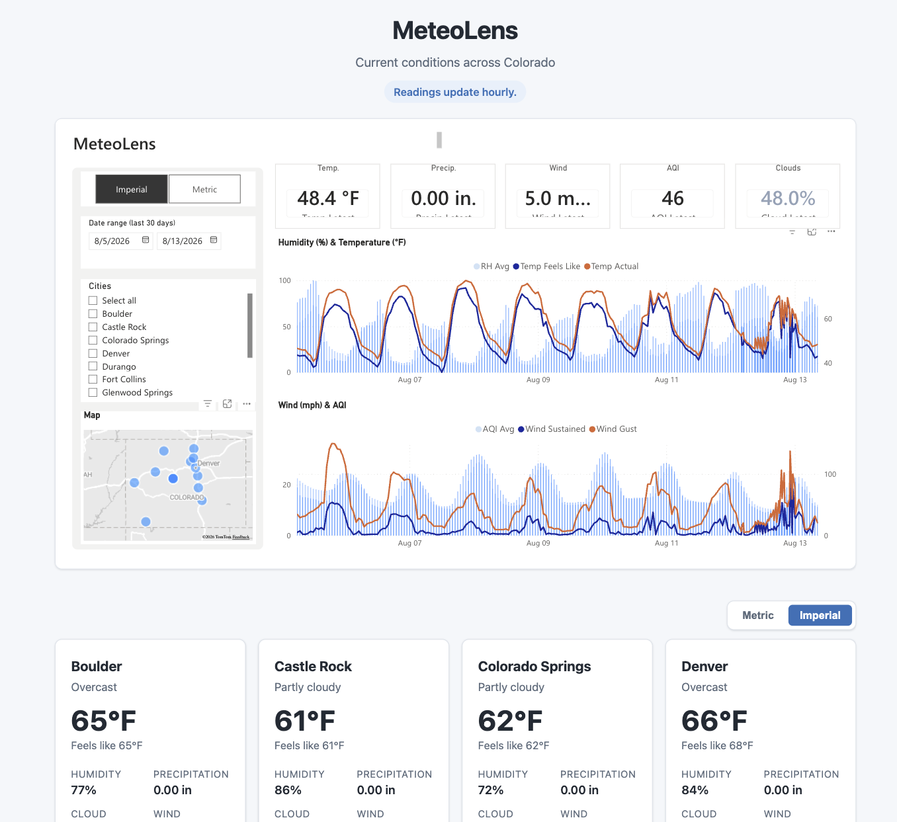

# MeteoLens

A lightweight, $0-to-run weather dashboard for Colorado. MeteoLens fetches hourly "current conditions" from the [Open-Meteo API](https://open-meteo.com/), stores them in Supabase Postgres, and visualizes them in a Power BI report embedded at **[meteolens.jonhammond.org](https://meteolens.jonhammond.org)**.



## How it works

```
cron-job.org (hourly) ──▶ Flask on Render ──▶ Open-Meteo API
                             │
                             ├──▶ Supabase Postgres  (system of record)
                             └──▶ Power BI push dataset ──▶ report ──▶ Publish-to-web iframe
```

Every hour, a scheduled trigger calls a token-protected ingest endpoint on the Flask app. For each active location, the app fetches current conditions from Open-Meteo and performs a dual write: an idempotent upsert into Supabase, and a push of the same row (enriched with WMO weather-code descriptions and display helpers) into a Power BI push dataset. The public report is embedded on the site via Power BI's Publish to web.

## Stack

| Layer | Technology | Cost |
|---|---|---|
| Data source | Open-Meteo API (no key, non-commercial) | $0 |
| Database | Supabase Postgres (free tier) | $0 |
| App server | Python Flask + gunicorn on Render (free tier) | $0 |
| Frontend | Flask/Jinja templates + CSS3 | $0 |
| Visualization | Power BI Service (free license, Publish to web) | $0 |
| Scheduler | cron-job.org | $0 |

## Tracked locations

Twelve Colorado cities: Denver, Colorado Springs, Pueblo, Leadville, Fort Collins, Durango, Grand Junction, Glenwood Springs, Steamboat Springs, Castle Rock, Longmont, and Boulder. Locations live in a database table, so adding or removing one is a SQL insert — no redeploy.

## Project status

🚀 **Shipped and live at [meteolens.jonhammond.org](https://meteolens.jonhammond.org).** Hourly ingestion, the Supabase system of record, the Power BI report, and the public site are all in production.

Design and architecture docs are kept for reference:

- [PLAN.md](PLAN.md) — full architecture, database schema, milestones M1–M8, risks, and verification checklist
- [API_PLAN.md](API_PLAN.md) — Open-Meteo fields targeted and the Power BI visual requirements they serve

## Configuration

All secrets are supplied via environment variables (`SUPABASE_URL`, `SUPABASE_SERVICE_ROLE_KEY`, `POWERBI_PUSH_URL`, `INGEST_TOKEN`, `POWERBI_EMBED_URL`); the app fails fast at startup if any are missing. Nothing sensitive is committed to this repository.

## License & data attribution

Code is licensed under the [MIT License](LICENSE).

Weather data by [Open-Meteo.com](https://open-meteo.com/), used under their free non-commercial API terms (data licensed [CC BY 4.0](https://creativecommons.org/licenses/by/4.0/)).
